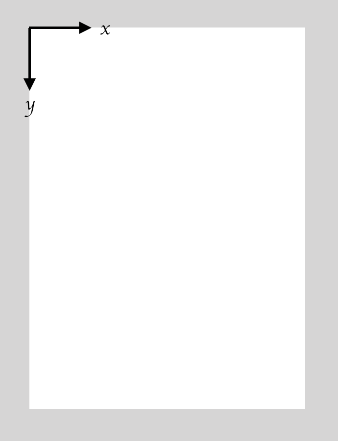

# IOS 中使用 UIGraphics 对图像做变换

## Why

为什么要做图像变换呢？比如说，我们拿到一个 UIImage 对象，想更改它的长宽或者进行缩放，旋转，这些都是对图像的变换操作。

## 具体怎么做

涉及到这几个 API

| API | 作用 |
| -- | -- |
| UIGraphicsBeginImageContextWithOptions| 开始一个 context |
| UIGraphicsGetCurrentContext | 拿到当前的 context |
| UIGraphicsGetImageFromCurrentImageContext | 从当前的 context 拿到图像 |
| UIGraphicsEndImageContext | 结束 context |

先上一段代码

```swift
UIImage image = ... // 这是原图

let drawingBox = CGRect(...)
let rotateAngle = 90 / 360 * 2 * CGFloat.pi // 顺时针旋转

UIGraphicsBeginImageContextWithOptions(drawingBox.size, false, 0.0)

UIGraphicsGetCurrentContext()?.translateBy(x: 100, y: 0)

UIGraphicsGetCurrentContext()?.rotate(by: rotateAngle)

image.draw(in: CGRect(x: 0, y: 0, width: image.size.width, height: image.size.height))

let newImage = UIGraphicsGetImageFromCurrentImageContext()!

UIGraphicsEndImageContext()
```

在上述代码中，`image` 是输入的图像，`UIGraphicsBeginImageContextWithOptions` 这句的作用，是创建一个 width * height 的矩形区域，可以理解为内存中的一块画布吧。


这块画布上有一个**绘制坐标系**，你可以把这个绘制坐标系想象成一个拿着笔的人，他现在拿着笔尖正处于原点的位置。



`UIGraphicsGetCurrentContext()?.translateBy` 这句的作用是平移绘制坐标系，这里的平移有两个参数，分别是顺着 x 轴平移的距离和顺着 y 轴平移的距离，而不是相对于画布的 x 轴与 y 轴。这有什么区别呢？这里的区别是，如果坐标系旋转了一定的角度，再进行平移，是顺着坐标系的坐标轴平移的，而不是画布的坐标轴。

所以和 `UIGraphicsGetCurrentContext()?.rotate` 对绘制坐标系做旋转，参数是弧度，顺时针。

比如说先沿着 X 轴平移 100，再旋转 45°，会形成下面的状况。


如果先旋转 45°，再沿着 X 轴平移 100，则


接下来再说 `image.draw(in: CGRect(x, y, width, height))` 方法，这个方法的参数也是有讲究的，前两个参数 x 和 y，是指基于绘制坐标系偏移多少开始画。而后两个参数 width, height 是指，要将原始图像绘制在 width * height 的矩形里面，这个绘制是缩放的，而不是裁剪的。

比如，如果在平移在旋转的基础上，执行
```swift
image.draw(in: CGRect(x: 100, y: 100, width: 100, height: 100))
```

则会形成下面的状况。


以上就是我想讲清楚的事情。