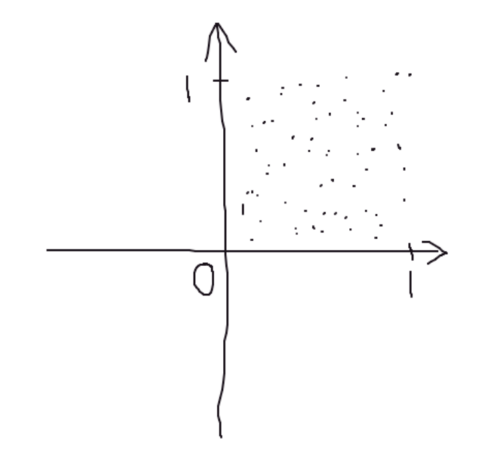
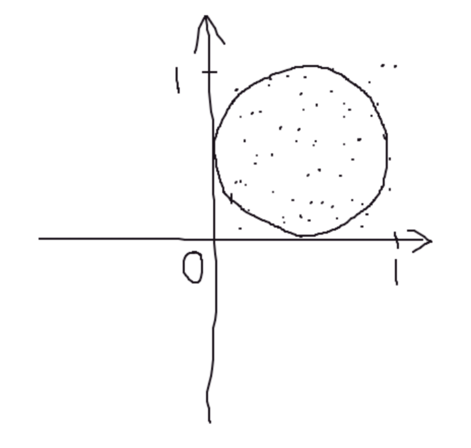
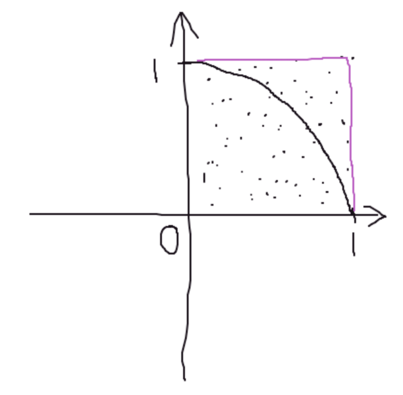

# 如何使用随机数计算出圆周率的值

## 来源
这是一道我在看 Youtube 时无意间发现的问题，原视频链接：https://www.youtube.com/watch?v=pvimAM_SLic

问题是：**给你一个生成0到1之间随机数的函数，请求出圆周率 π**

第一眼看上去仿佛是一个完全没头脑的问题，但是仔细一想，就可以使用一点编程能力和初中的数学知识解决。

## 思路

思路应该是去寻找两个东西的交汇点，一个随机数，是一个数字，也可以是数轴上的一个点。两个随机数，就是两个数轴上的点，或者是一个坐标轴上的点`（r1, r2）`，如果调用无数次的随机数，就可以获得无数个坐标轴上的点。

圆周率，我们必须要找到一个使用了圆周率的东西，很容易想到圆的面积和周长。

现在我们有了**无数个在坐标轴上的点**、**圆的面积**、**圆的周长**。emmmm……有想到什么吗？

也许我们应该画一个图。



也许我们应该把圆画上去，应该会帮助我们思考。



OK，知道了，所有的点会落在正方形(0,0,1,1) 的范围内，其中有一部分会落在圆的范围内，如果我们统计**落在圆内的点的个数，记为 N**，那么 N 与**总点数 M **的比值，应该是等于圆的面积比上正方形的面积。

列下公式应该是：


^2})

把公式化简一下，变成：


为了编程中方便计算任意点距离圆心的距离，可以这样理解这个概率：


公式中的关系依然成立。

## 编程实现

```kotlin
fun main() {
    var times = 100L
    for (i in 1..9) {
        println("loop: $times pi: ${getPi(times)}")
        times *= 10
    }
}

fun getPi(count: Long): Double {
    var c = 0
    for (i in 0 until count) {
        val x = Math.random()
        val y = Math.random()

        if (x * x + y * y < 1) {
            c++
        }
    }
    return 4.0 * c / count
}
```

运行结果：
```
loop: 100 pi: 3.24
loop: 1000 pi: 3.168
loop: 10000 pi: 3.1528
loop: 100000 pi: 3.14348
loop: 1000000 pi: 3.141964
loop: 10000000 pi: 3.1414304
loop: 100000000 pi: 3.14131604
loop: 1000000000 pi: 3.141585632
loop: 10000000000 pi: 3.1415885784
```