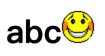
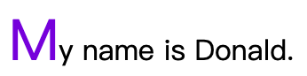

# CSS-选择器

目录
* [1.简单选择器](#1.简单选择器)
* [2.组合选择器](#2.组合选择器)
* [3.Pseudo Classes Selector](#3.Pseudo-Classes-Selector)
* [4.Pseudo Elements Selector](#4.Pseudo-Elements-Selector)
* [5.属性选择器](#5.属性选择器)

选择器大体上可以分为 5 类：
* 简单选择器：基于元素的名字、id 或者 class
* 组合选择器：基于元素之间的关系
* 伪类选择器：基于元素特定状态
* 伪元素选择器：基于元素的特定位置
* 属性选择器：基于元素的属性

## 1.简单选择器

<details>
<summary>通过标签名进行选择</summary>

```css
/* 将选中所有的 <p> 标签 */
p { ... }

/* 将选中所有的 <h1> 标签 */
h1 { ... }
```
</details>

<details>
<summary>通过 id 和 class 进行选择</summary>

```css
/* 选择某个标签的 id 为 myId 的标签，如：<p id="myId"> */
#myId { ... }

/* 选择标签的 class 为 myClass 的所有标签，如：<p class="myClass"> */
.myClass { ... }
```

</details>

<details>
<summary>标签名和 id、class 名组合在一起进行选择</summary>

```css
/* 选择 <p> 标签中 class 为 myClass 的元素 */
p.myClass { ... }

/* 这种似乎意义不大？ */
p#myId { ... }
```

</details>

<details>
<summary>通配符(*)也可以作为选择器，选中所有元素</summary>

```css
* { ... }
```

</details>

<details>
<summary>多个选择器并列</summary>

```css
h1, h2, p {
    text-align: center;
    color: red;
}
```

</details>

## 2.组合选择器

组合选择器通过描述元素之间的关系来选择。

<details>
<summary>后代选择器，可以隔代传递</summary>

```css
div p { ... }
```
```html
<div>
    <p>我会被选中</p>
</div>
<div>
    <section>
        <p>我也会</p>
    <section>
</div>
```

</details>

<details>
<summary>Child 选择器，选中直接的后代，不能隔代</summary>

```css
div > p { ... }
```
```html
<div>
    <p>我会被选中</p>
</div>
<div>
    <section>
        <p>我不会被选中了</p>
    <section>
</div>
```

</details>

<details>
<summary>Adjacent Sibling Selector(相邻选择器)</summary>

```css
div + p { ... } /* 跟在 div 后面的一个 p 会被选中 */
```
```html
<div></div>
<p>可以被选中</p>
<p>不能被选中</p>
```

</details>

<details>
<summary>General Sibling Selector</summary>

```css
div ~ p { ... } /* 所有跟在 div 后面的 p 都会被选中 */
```
```html
<div></div>
<p>可以被选中</p>
<a>不能被选中！</a>
<p>可以被选中</p>
```

</details>

## 3.Pseudo Classes Selector

伪类选择器有很多，大体上可以分类一下：

* 与 UI 状态有关
    * :link
    * :visited
    * :hover
    * :active
    * :focus
    * :enabled
    * :disabled
    * :checked
* 与文档结构有关
    * :first-child
    * :nth-child(n)
    * :nth-last-child(n)
    * :nth-of-type(n)
    * :nth-last-of-type(n)
    * :last-child
    * :first-of-type
    * :last-of-type
    * :only-child
    * :only-of-type
    * :root
    * :empty
* 其他
    * :not(x)
    * :target
    * :lang(language)

## 4.Pseudo Elements Selector

直译为伪元素选择器，伪元素，就是不是真正的元素，它可以用来指定元素中一部分内容的样式。

<details>
<summary>::before，::after，在某个标签前面、后面插入一些内容</summary>

```css
h1::after {
  content: url(smiley.gif);
}
```

```html
<h1>abc</h1>
```

效果如图



</details>

<details>
<summary>::selection，对框选的部分应用样式</summary>

```css
p::selection {
    color: blue; /* 选中的文字变成蓝色 */
}
```

</details>

<details>
<summary>::first-letter，::first-line 如字面意思，第一个字符和第一行会应用样式</summary>

```css
p::first-letter {
    font-size: 200%;
    color: #8A2BE2;
}
```
```
<p>My name is Donald.</p>
```


</details>

## 5.属性选择器

<details>
<summary>[attribute] 选择所有具备 attribute 属性的元素</summary>

```css
[id] {
    font-size: 200%;
    color: #8A2BE2;
}
```
```
<p id="a">会被选中</p>
<p >不会被选中</p>
```

</details>

<details>
<summary>[attribute="value"] 选择具备 attribute 属性和 value 的元素</summary>

```css
[id="a"] {
    font-size: 200%;
    color: #8A2BE2;
}
```
```html
<p id="a">会被选中</p>
<p id="b">不会被选中</p>
```

</details>

<details>
<summary>[attribute~="value"] 选择具备 attribute 属性和属性值以空格隔开后能匹配value的元素</summary>

```css
[id~="a"] {
    font-size: 200%;
    color: #8A2BE2;
}
```
```html
<p id="a">会被选中</p>
<p id="b a">会被选中</p>
<p id="b-a">不会被选中</p>
```

</details>

<details>
<summary>[attribute|="value"] 选择具备 attribute 属性和属性值以 value “开头”的元素</summary>

value 必须是整个属性值的“一整块”，而不能是一部分，“一整块”的意思是，可以用`-`分隔。

```css
[id=|"a"] {
    font-size: 200%;
    color: #8A2BE2;
}
```
```html
<p id="a">会被选中</p>
<p id="ab">不会被选中</p>
<p id="a-b">会被选中</p>
```

</details>

<details>
<summary>[attribute^="value"] 选择具备 attribute 属性和属性值 startWith(value) 的元素</summary>

value 是真正的开头了，后面可以有任何东西，也可以没有。

```css
[id^="a"] {
    font-size: 200%;
    color: #8A2BE2;
}
```
```html
<p id="a">会被选中</p>
<p id="ab">会被选中</p>
<p id="a-b">会被选中</p>
```

</details>

<details>
<summary>[attribute$="value"] 选择具备 attribute 属性和属性值 endWith(value) 的元素</summary>

```css
[id$="a"] {
    font-size: 200%;
    color: #8A2BE2;
}
```
```html
<p id="a">会被选中</p>
<p id="ba">会被选中</p>
<p id="b-a">会被选中</p>
```

</details>

<details>
<summary>[attribute*="value"] 选择具备 attribute 属性和属性值 contains(value) 的元素</summary>

```css
[id*="a"] {
    font-size: 200%;
    color: #8A2BE2;
}
```
```html
<p id="a">会被选中</p>
<p id="ba">会被选中</p>
<p id="b-a">会被选中</p>
<p id="aba">会被选中</p>
```

</details>