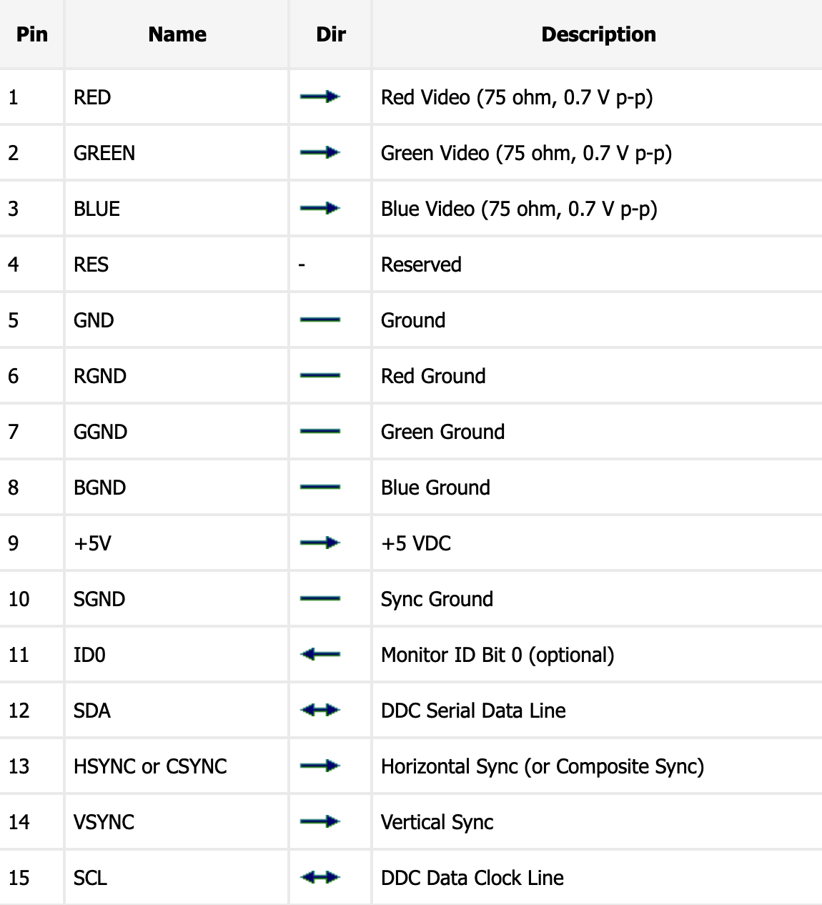

# VGA 是如何工作的？

## 1. 介绍

VGA 是 Video Graphics Adapter 或者 Video Graphics Array 的缩写，它是一种视频显示技术的标准。实现这个标准的接口就是那个蓝色的一大坨需要两个螺丝的视频接口，如下图所示：

上图所示的两个接口中，左边那个全是针的，用来插别人，通俗来说，我们就叫它 **VGA 公**，另一个全是洞洞，被别人插，就叫 **VGA 母**。虽然很邪恶，但事实上就是这么叫的，我好奇的搜了一下英文中的称呼，英文中使用 Male 和 Female 区分插与被插的关系，我觉得真是相当贴切。

VGA 总共有 15 个针脚，排列为 3 行，每行 5 个。如下图：

每个针（pin）都有特定的功能，详细的功能描述如下表，表格来源：[这里: VGA VESA Pinout](https://pinouts.ru/Video/VGAVesaDdc_pinout.shtml)

现在我们主要关注 pin 1, 2, 3, 13, 14，它们分别是表示颜色的 RGB 和水平同步、垂直同步信号。

## 2. VGA 是如何显示视频数据的？

VGA 中的 pin 1, 2, 3 分别表示 RGB 三个颜色分量，RGB 使用的是模拟信号，三根针里面的电压从 0 V ~ 0.7 V，pin 13 和 14 使用数字信号，即只表示 0 和 1 两个值，active low，意思是低电压表示激活，也就是 0 V 表示 1，高于 0 V 表示 0。

### 2.1. 颜色深度

使用 RGB 表示颜色值，所能表示颜色的多少，和每个分量的大小有关，具体来说可以参考这篇文章：[计算机如何表示图像信息]()。

那么模拟信号的 0 ~ 0.7 V 可以显示多少种颜色呢？根据我从[这里: VGA Color Palettes](https://www.fountainware.com/EXPL/vga_color_palettes.htm)查到的信息，VGA 支持 1, 2, 4, 8, 15, 16, 24 bit 的颜色模式。

对于 24 bit 颜色模式来说，每个颜色分量都是 8 bit，也就是说，每根 RGB 的线中的电压 0-0.7 要和 0-255 建立一个映射。

由于是模拟信号，因此如果有东西干扰了线缆，就可能会导致颜色出现偏差。

### 2.2. 规格

现在我们有了 3 根线，可以通过它们输出的电压得到一个颜色值了，接下来就是如何显示画面的问题了。

首先我们的画面是由一个宽和高决定的矩形区域，宽和高分别表示像素的数量。比如现在常见的 1920 * 1080。

在 VGA 的标准中指定了一些规格，它是一个列表，指定了有多少种应该支持的画面尺寸，这个表格完整的在[这里: VGA Timing](http://tinyvga.com/vga-timing)，下面截取一小部分。

随便点击一个，比如 **640x480@60Hz**。

我们可以看到，它规定了屏幕刷新率是多少：60 Hz，一秒钟刷新 60 次。

以及水平扫描需要的时间，垂直扫描需要的时间，总之，它就是一个规格说明书，告诉你，你想要支持某种分辨率和刷新率，就按照这个来实现就可以了。

### 2.3. 时序

现在来聊一聊，VGA 具体是如何显示一帧帧画面的，以下所有描述都以 **640x480@60Hz** 这个规格为前提。

RGB 3 根线在某个瞬间，只能表示一个颜色，也就是一个像素的颜色，那么我有 640 * 480 这么多个像素，要怎么表示呢？很容易想到，我只需要按照一个时序，在 T 时刻，RGB 表示第 0 个像素，在 T + 1 时刻，RGB 表示第 1 个像素，以此类推就好了。

由于画面尺寸不是固定的，因此需要一个用于**换行**的水平同步信号（H-Sync），来告诉显示器，我要换行了，当绘制到画面的最后一个像素，需要一个用来**回到开头**的垂直同步信号（V-Sync），来告诉显示器，需要重新绘制了。

我们可以来做个简单的计算，1 秒钟需要绘制整个画面 60 次，那么绘制 1 次需要 $1 秒 \div 60 = 16.667 毫秒$，总共有 480 行，那么绘制一行需要 $16.667 毫秒 \div 480 = 34.72 微秒$

需要水平和垂直同步信号来换行和刷新。

时序 timing

front porch 和 back front proch 的作用

### 2.4. ColorBurst 是什么

## 为什么要有两个螺丝

## 3. 参考资料

* [How exactly does a VGA cable work?](https://electronics.stackexchange.com/questions/166681/how-exactly-does-a-vga-cable-work)
* [VGA Adapter](http://www.eecg.utoronto.ca/~jayar/ece241_06F/vga/index.html)
* [Introduce to VGA](http://media.ee.ntu.edu.tw/personal/pcwu/dclab/dclab_10.pdf)
* [what-is-front-porch-and-back-porch-of-a-video-signal-in-crt-display](https://electronics.stackexchange.com/questions/201011/what-is-front-porch-and-back-porch-of-a-video-signal-in-crt-display/201014#201014)
* [Horizontal blanking interval](https://en.wikipedia.org/wiki/Horizontal_blanking_interval)
* [Colorburst](https://en.wikipedia.org/wiki/Colorburst)
* [Analog television](https://en.wikipedia.org/wiki/Analog_television)