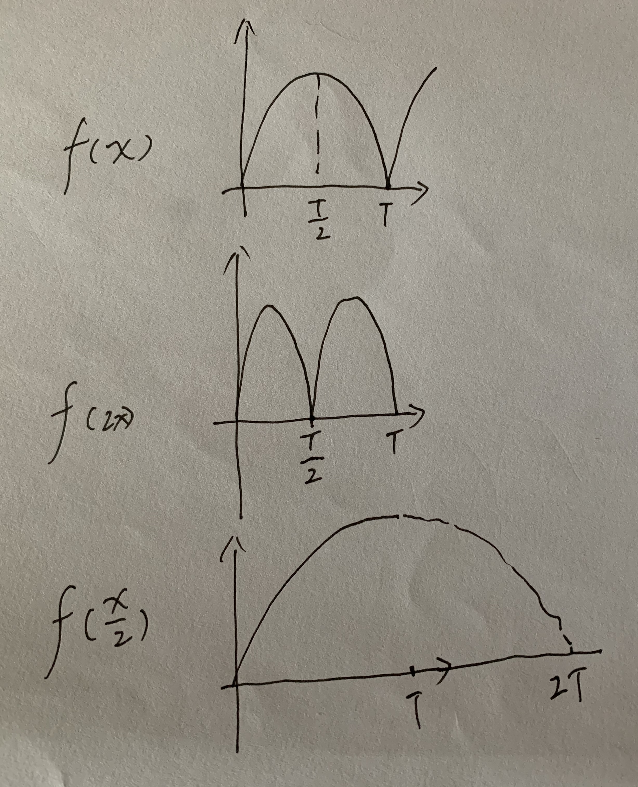

# 函数

## 函数的定义

如果有一个 $y = f(x)$ ，满足任意 $x$ 都有唯一的一个 $y$ 与之对应，$f(x)$ 就是一个关于 $x$ 的函数。

## 函数的表示方法

解析法，列表法，图像法

## 函数的性质

### 周期性

$f(x) = f(x +T)$, $T$ 是满足条件的最小正数

**例题**

$f(x)$ 的周期是 T，请问 $f(2x), f(\frac{x}{2})$ 的周期是多少？

**推导**

这里用图像来理解最为直观。

### 奇偶性

定义域必须关于原点对称。

偶函数：$f(x) = -f(x)$

奇函数：$f(x) = -f(-x)$

### 单调性

单调递增，单调递减，是指在一段区间里面，图形上看，很单调（字面意义上的单调，很单调很枯燥，没有变化的意思）。

### 有界性

如果 $N \le f(x) \le M$，那么函数的值域，就被框在$[N, M]$之间，$N$ 与 $M$ 就是这个函数的下界和上界。

## 反函数

原来的函数必须是一一对应的，才存在反函数。构造出反函数后，定义域和值域互换。

反函数关于 $y = x$ 这条直线对称。

$y = 2x$ -> $y = \frac{x}{2}$